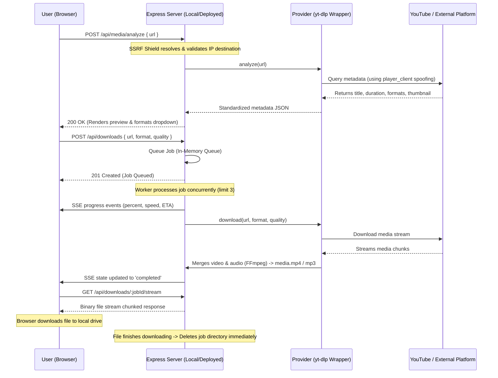

# MediaFlow — Universal Media Downloader & Converter

MediaFlow is a modern, privacy-focused, accountless media downloading and conversion platform. Designed with high-performance provider abstractions and a premium dark UI layout, MediaFlow permits users to parse and stream publicly accessible web media directly to their local computers.

---

## 📖 How It Works (Working Procedure)

MediaFlow's execution lifecycle is clean, fast, and completely runs on the server/local backend without permanently storing file metadata.



1. **Analysis Phase**: The user pastes a supported URL. The backend resolves the hostname's DNS (SSRF Shield protection) to block private IP addresses, then invokes the designated provider wrapper (utilizing an embedded, dynamically updated `yt-dlp` binary). The provider extracts details (such as title, duration, and formats) and returns it.
2. **Queueing & Downloading**: Once the user selects a quality and clicks **Queue Download**, an in-memory job is created. The backend downloads the media stream to a temporary directory. If audio/video merging or conversion (e.g., MP3) is requested, **FFmpeg** processes it automatically.
3. **SSE Progress Feedback**: Throughout the download, the server pushes real-time progress, download speed, and remaining time (ETA) back to the client via Server-Sent Events (SSE).
4. **Stream & Cleanup**: When the download is ready, the frontend requests the file. The server streams the file directly to the browser and **immediately deletes the local temp folder** on transfer completion to maintain zero-log privacy.

---

## 🚀 Step-by-Step Setup Guide

### 1. System Prerequisites
* **Node.js**: v18.0.0 or later (v20+ recommended)
* **NPM**: v9 or later
* **FFmpeg**: Handled automatically via pre-compiled binaries (`@ffmpeg-installer/ffmpeg`), no global installation required!

### 2. Standard Local Run (Development Mode)
This runs the frontend on port `5173` and the backend on port `5000`:

1. **Clone the workspace** and install all package dependencies:
   ```bash
   npm run install:all
   ```
2. **Start the development servers**:
   ```bash
   npm run dev
   ```
3. Open your browser and navigate to:
   * **Frontend**: `http://localhost:5173`
   * **Backend Health Check**: `http://localhost:5000/api/health`

---

## 💻 Running as a Local Laptop Service (Single-Port Mode)

If you want MediaFlow to run locally in the background on your laptop on a dedicated port (e.g., **`8084`**), you can configure it as a single node process serving both the frontend files and backend API.

### Step 1: Configure Port and API
Configure your local environment files at the root of the project:

1. Create or edit **[`frontend/.env`](file:///home/sampatakumar/D_drive/downloader/frontend/.env)**:
   ```env
   VITE_API_BASE=""
   ```
   *(This configures Vite to use relative API paths instead of hardcoded dev ports).*

2. Create or edit **[`backend/.env`](file:///home/sampatakumar/D_drive/downloader/backend/.env)**:
   ```env
   CORS_ORIGINS=http://localhost:8084
   PORT=8084
   NODE_ENV=development
   TEMP_DIR=./temp
   MAX_CONCURRENT_JOBS=3
   ```

### Step 2: Build the Frontend
Compile the React code into static assets:
```bash
npm run build
```
*(Vite builds the static bundle into `frontend/dist`. The backend is pre-configured to detect this folder and serve it automatically on `/`).*

### Step 3: Test Standalone Execution
Start the backend directly from the project root:
```bash
node backend/src/server.js
```
Open **`http://localhost:8084`** in your browser. The application should load and operate completely from this single port.

### Step 4: Configure Automatic Autostart (Linux/systemd)
To ensure the app starts automatically in the background whenever you log into your laptop:

1. Copy the systemd service template to your user-level systemd directory:
   ```bash
   mkdir -p ~/.config/systemd/user/
   cp mediaflow.service ~/.config/systemd/user/
   ```
2. Reload the systemd daemon to pick up the new service:
   ```bash
   systemctl --user daemon-reload
   ```
3. Enable and start the service:
   ```bash
   systemctl --user enable mediaflow.service
   systemctl --user start mediaflow.service
   ```
4. Verify the service status is active:
   ```bash
   systemctl --user status mediaflow.service
   ```

To stop or restart the service manually:
```bash
systemctl --user stop mediaflow.service
systemctl --user restart mediaflow.service
```

---

## 🔒 Security and Anti-Bot Features

1. **Direct Binary Bootstrapper**: In production/datacenter hosting (like Render), YouTube blocks public APIs. MediaFlow bypasses this on server startup by fetching the latest `yt-dlp` executable directly from GitHub's static releases, replacing stale cached files.
2. **CORS Preview Support**: The backend supports Vercel preview deployment domains (`https://media-flowyt*.vercel.app`) dynamically, protecting your endpoints while allowing easy team staging checks.
3. **CORS Restrictions**: Standard local requests are limited to origin-matched hosts (`http://localhost:8084` or `http://localhost:5173`).
4. **Proxy Support**: You can route all metadata queries through SOCKS5/HTTP proxies by setting a `PROXY_URL` environment variable (e.g. in your Render dashboard) to circumvent datacenter blocks.
